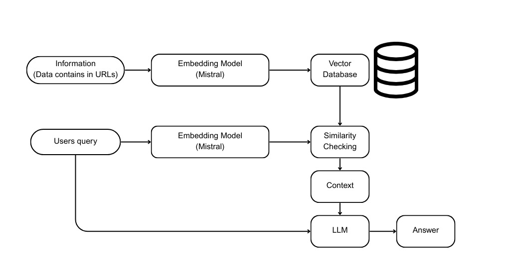

# 🌌 TARS Terminal

**TARS-Terminal-Your-AI-co-pilot-for-understand-Interstellar**

**TARS Terminal** is a sleek Retrieval-Augmented Generation (RAG) system tailored for answering questions from a specific knowledge base. This system was built using **Mistral**, **Haystack** and the UI by **Streamlit**. This project showcase the full RAG pipeline in action, using the movie _interstellar_ as a case study.

# 🚀 Features

* 🔍 Semantic search using In memory document store.

* 🧠 Contextual answer generation with the Mistral LLM

* 📚 Custom document ingestion and indexing

* 🌐 Intuitive Streamlit-based user interface

* 🧩 Modular architecture for easy customization


# 🧰 Technologies Used

* **Mistral**: Open-weight LLM for text generation (https://mistral.ai/)

* **Haystack**: Backend pipeline for RAG (https://haystack.deepset.ai/overview/intro)

* **Streamlit**: UI for rapid web app deployment (https://streamlit.io/)


# 📦 Installation

1. Clone the repository:

```bash
git clone https://github.com/your-username/tars-terminal.git
cd tars-terminal
```

2. (Recommended) Create a virtual environment:

```bash
python -m venv venv
source venv/bin/activate  # On Windows: venv\Scripts\activate
```

3. Install dependencies:

```bash
pip install haystack
pip install mistral-haystack
pip install streamlit
```

4. Add the prepared document URLs to the source code. (Note: Be carefull about the sources, the information should be structured and less noisy)

5. Run the app:

```bash
streamlit run interstellar.py
```

# 🧠 System Architecture




